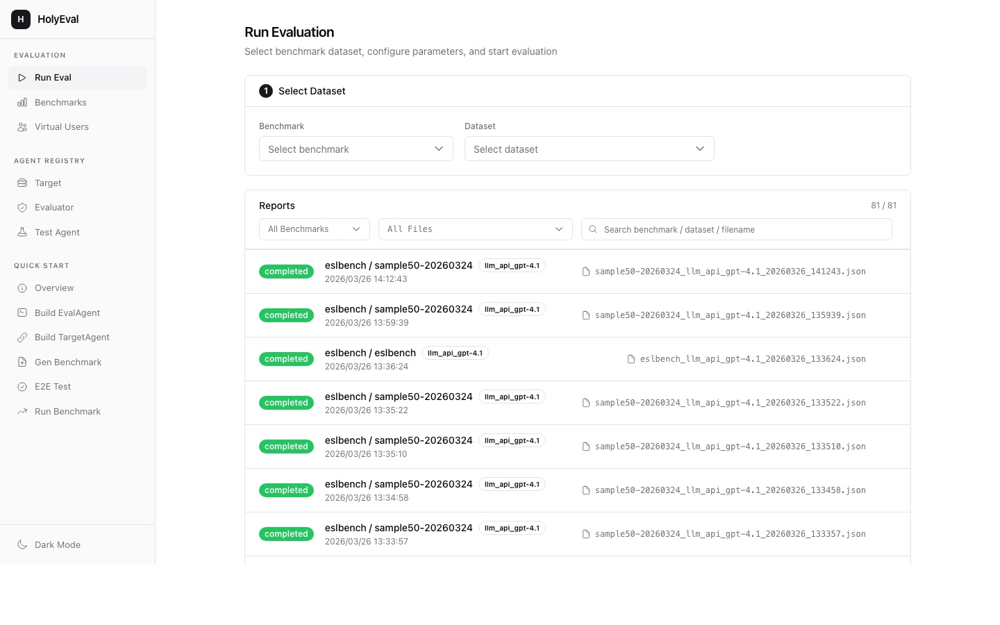
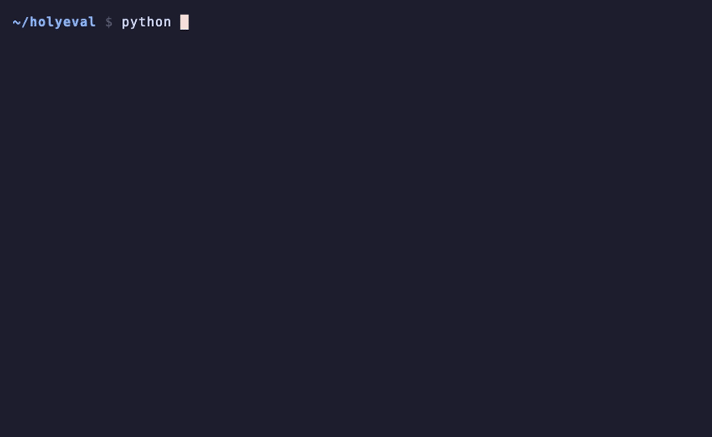
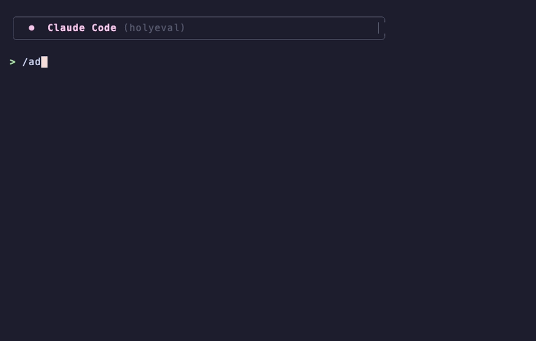
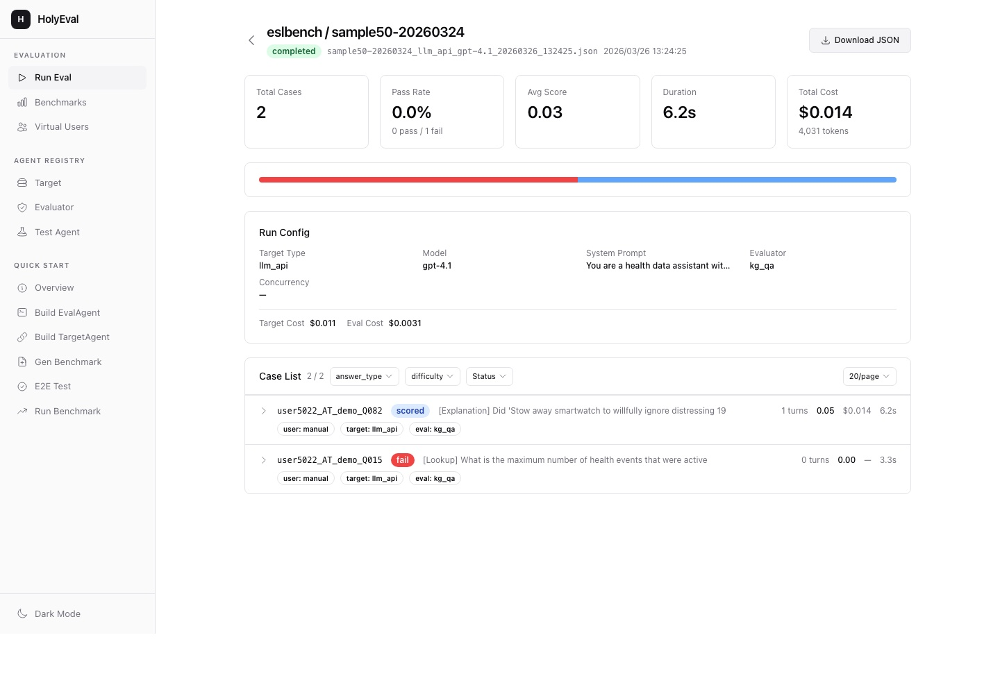
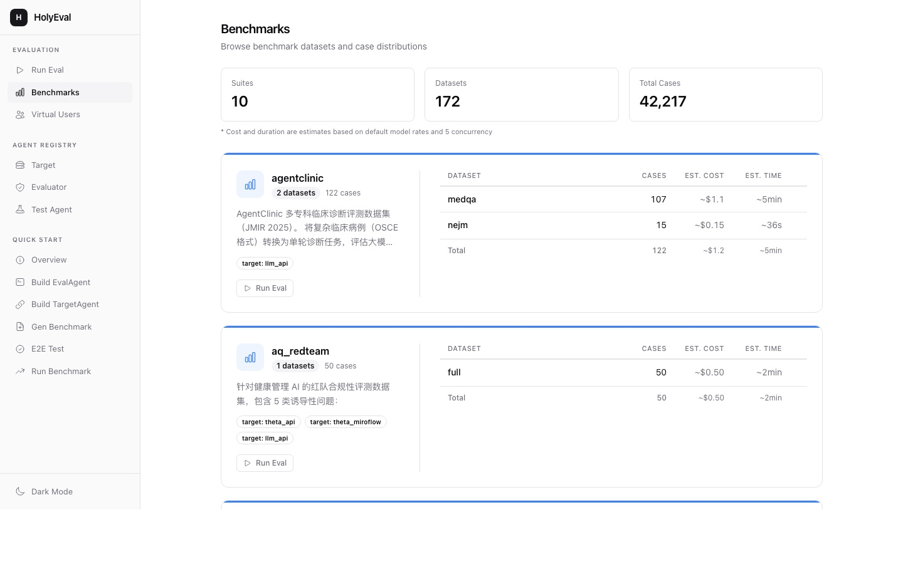
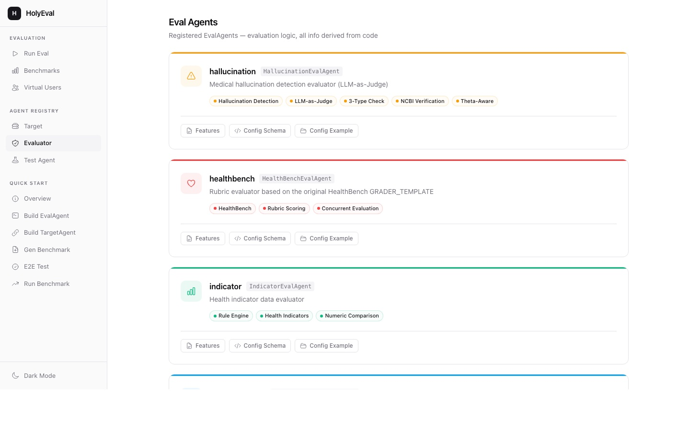
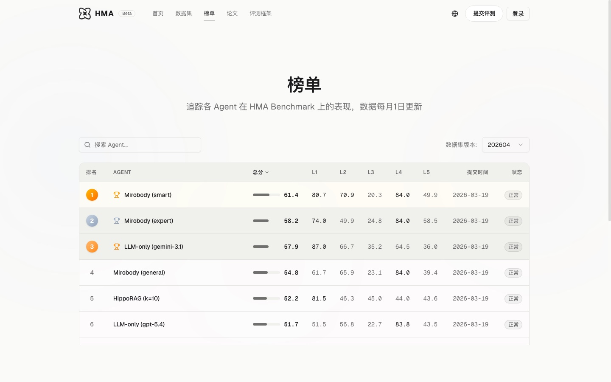
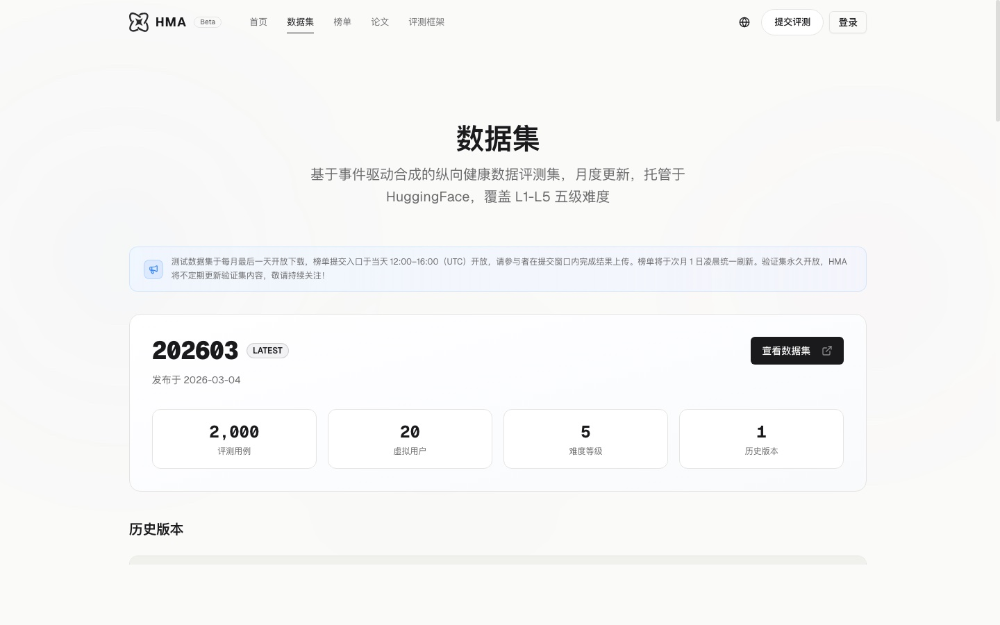
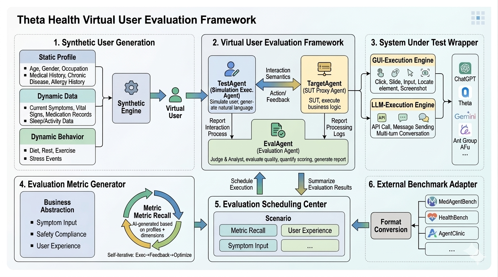

<h1 align="center">
  <br>
  HolyEval
  <br>
</h1>

<p align="center">
  <strong>Reproduce any LLM benchmark with one command. Build your own with pluggable agents.<br>No code required — just talk to Claude Code.</strong>
</p>

<p align="center">
  <a href="https://github.com/healthmemoryarena/holyeval/blob/main/LICENSE"></a>
  <a href="https://www.python.org/downloads/"></a>
  <a href="https://docs.anthropic.com/en/docs/claude-code"></a>
  <a href="https://huggingface.co/datasets/healthmemoryarena/ESL-Bench"></a>
  <a href="http://healthmemoryarena.ai"></a>
  <a href="https://github.com/healthmemoryarena/holyeval/stargazers"></a>
</p>

<p align="center">
  <a href="#quick-start">Quick Start</a> &middot;
  <a href="#ai-native-development-with-claude-code">Claude Code</a> &middot;
  <a href="#web-ui">Web UI</a> &middot;
  <a href="http://healthmemoryarena.ai">Live Demo</a> &middot;
  <a href="https://huggingface.co/datasets/healthmemoryarena/ESL-Bench">Dataset</a> &middot;
  <a href="#benchmarks">Benchmarks</a> &middot;
  <a href="#contributing">Contributing</a>
</p>

<p align="center">
  
</p>

---

HolyEval is an AI-native, open-source evaluation framework for large language models. Drop in a benchmark dataset, run one command, get a scored report. Extend it with custom evaluators, target systems, and virtual users via a pluggable agent architecture.

Built from the ground up as a [Claude Code](https://docs.anthropic.com/en/docs/claude-code) native project — every workflow, from initial setup to integrating a new benchmark from a research paper, is an interactive slash command. You describe what you want in natural language, and Claude Code handles the rest. **You don't need to write a single line of code to use or extend this framework.**

```bash
# ESLBench — synthetic health KG Q&A, 1800 cases across 5 difficulty levels
python -m benchmark.basic_runner eslbench sample50-20260324 --target-model gpt-4.1

# HealthBench (medical AI, 100 cases)
python -m benchmark.basic_runner healthbench sample --target-model gpt-4.1

# MedCalc-Bench (medical calculations)
python -m benchmark.basic_runner medcalc sample --target-model gpt-4.1

# MemoryArena (agent memory, 701 cases)
python -m benchmark.basic_runner memoryarena full --target-model gemini-3-pro
```

Each benchmark is a published paper you can reproduce in one line.

## Why HolyEval?

| | |
|---|---|
| **One-command reproduction** | Integrate a published benchmark once, reproduce it forever with a single CLI command |
| **Pluggable architecture** | Three agent types (TestAgent, TargetAgent, EvalAgent) — extend any of them with a single class |
| **Multi-turn dialogue** | Simulates real user conversations, not just single-turn Q&A |
| **Batch execution** | Concurrent runs with real-time progress, cancellation, and checkpoint resume |
| **Web UI** | Visual dashboard for running evaluations, viewing reports, and browsing datasets |
| **AI-native** | Built for [Claude Code](https://docs.anthropic.com/en/docs/claude-code) — set up, run, and extend the project through natural language, zero boilerplate |

## Quick Start

### Option A: AI-guided setup (recommended)

Install [Claude Code](https://docs.anthropic.com/en/docs/claude-code), then:

```
/quick-start
```

Claude Code will check your environment, install dependencies, walk you through API key configuration, and launch the Web UI. No manual steps needed.

### Option B: Manual setup

**Prerequisites:** Python 3.11+, [uv](https://docs.astral.sh/uv/) package manager, at least one LLM API key (OpenAI or Google Gemini).

```bash
git clone https://github.com/healthmemoryarena/holyeval.git
cd holyeval
uv sync

cp .env.example .env
# Edit .env — add your OPENAI_API_KEY or GOOGLE_API_KEY
```

### Prepare benchmark data

Some benchmarks (like ESLBench) require downloading external data before running. This step is **automatic** when using the Web UI, but needs to be run manually for CLI usage:

```bash
# ESLBench: download synthetic health KG data from HuggingFace + build per-user DuckDB indexes
# Requires HF_TOKEN in .env (get one at https://huggingface.co/settings/tokens)
python -m generator.eslbench.prepare_data

# Force rebuild (re-download + rebuild DuckDB)
python -m generator.eslbench.prepare_data --force
```

Other benchmarks (HealthBench, MedCalc, MemoryArena, etc.) ship with data included — no preparation needed.

### Run your first benchmark

<p align="center">
  
</p>

```bash
# Quick smoke test: 10 HealthBench cases, 3 concurrent
python -m benchmark.basic_runner healthbench sample --target-model gpt-4.1 --limit 10 -p 3

# Full run
python -m benchmark.basic_runner healthbench sample --target-model gpt-4.1

# Resume if interrupted
python -m benchmark.basic_runner healthbench sample --resume
```

### Launch Web UI

```bash
python -m web    # http://localhost:8000
```

## AI-Native Development with Claude Code

HolyEval is designed to be operated entirely through [Claude Code](https://docs.anthropic.com/en/docs/claude-code). Every common task has a dedicated slash command. You describe your intent in natural language; Claude Code reads the code, generates files, runs tests, and validates the result.

**You don't need to memorize CLI flags, read source code, or write boilerplate.** Just type the slash command and follow the conversation.

### Slash Command Reference

| What you want to do | Command | What Claude Code does for you |
|---|---|---|
| **Set up the project** | `/quick-start` | Checks Python/uv, installs dependencies, configures `.env` with your API keys, launches Web UI |
| **Run a benchmark** | `/run-benchmark` | Asks which benchmark & dataset, then executes with your chosen model and concurrency |
| **Integrate a new benchmark** | `/add-benchmark` | End-to-end: reads the paper/repo → analyzes data format → writes the converter → creates dataset → validates |
| **Add a custom evaluator** | `/add-eval-agent` | Scaffolds config model + plugin implementation + registration. Immediately available in CLI & Web UI |
| **Add a new target system** | `/add-target-agent` | Scaffolds connection handling, message processing, and cleanup for a new system under test |
| **Run end-to-end tests** | `/run-e2e-test` | Verifies all components (TestAgent ↔ TargetAgent ↔ EvalAgent ↔ Orchestrator) work together |
| **Audit architecture** | `/review-architecture` | Checks GitOps compliance, plugin isolation, shared-layer reuse. Reports violations with fix suggestions |

### Example: Integrating HealthBench from a Research Paper

This is a real example of how Claude Code integrates a published benchmark into HolyEval — end-to-end, from paper to runnable evaluation:

<p align="center">
  
</p>

```
You:  /add-benchmark

      Paper: https://arxiv.org/abs/2505.07469
      HealthBench is OpenAI's medical AI evaluation benchmark with 5,000+
      rubric-graded questions across safety, reasoning, and instruction following.

Claude: I'll read the paper and source repo to understand the data format...
        ✓ Found: JSONL with multi-turn prompts + rubric criteria
        ✓ Evaluation method: per-rubric LLM-as-Judge grading

        Generating converter: generator/healthbench/converter.py
        - Maps prompt → history + strict_inputs
        - Maps rubrics → eval.rubrics (criterion + points)
        - Sets user.type = "manual", target.type = "llm_api"

        Generating dataset: benchmark/data/healthbench/
        - metadata.json (target config + description)
        - sample.jsonl (100 cases, stratified sampling)
        - full.jsonl (5,000+ cases)
        - hard.jsonl / consensus.jsonl (subsets)

        Running validation: 3 cases with gpt-4.1...
        ✓ All 3 passed — benchmark ready!

You:  python -m benchmark.basic_runner healthbench sample --target-model gpt-4.1
      # Running... 100 cases → report saved
```

> **The entire integration — reading the paper, writing the converter, creating datasets, validating — takes one conversation.** No boilerplate, no manual file creation, no debugging import paths.

### More Workflow Examples

**"I want to reproduce HealthBench on GPT-4.1"**
```
> /run-benchmark
# Claude asks: which benchmark? → healthbench
# Which dataset? → sample
# Which model? → gpt-4.1
# Running... 100 cases, 5 concurrent → report saved
```

**"I need a custom evaluator that checks citation accuracy"**
```
> /add-eval-agent
# Claude asks: plugin name? → citation_accuracy
# What does it evaluate? → checks if AI responses cite valid sources
# Generates: evaluator/plugin/eval_agent/citation_accuracy_eval_agent.py
# Registered automatically via __init_subclass__ — ready to use
```

> **Tip:** You're not limited to slash commands. Claude Code understands the full codebase — ask it anything in natural language, like *"explain how the plugin system works"* or *"why did this test case fail?"*.

## Web UI

Launch with `python -m web`, then visit http://localhost:8000.

<table>
<tr>
<td width="50%">

**Run Evaluations** — Select benchmark, configure parameters, launch tasks with real-time SSE progress tracking.


</td>
<td width="50%">

**Evaluation Report** — Scored results with expandable cases, dialogue history, and per-case feedback.


</td>
</tr>
<tr>
<td width="50%">

**Browse Benchmarks** — Overview of all benchmark datasets with case counts and statistics.


</td>
<td width="50%">

**Agent Registry** — Inspect all registered plugins with config schemas, features, and cost estimates.


</td>
</tr>
</table>

## Health Memory Arena — Live Evaluation Platform

[Health Memory Arena](http://healthmemoryarena.ai) (HMA) is the public evaluation platform powered by HolyEval. It hosts the ESL-Bench leaderboard where health AI agents compete on structured longitudinal reasoning tasks.

<table>
<tr>
<td width="33%">
<a href="http://healthmemoryarena.ai"></a>
<p align="center"><em>Platform Home</em></p>
</td>
<td width="33%">
<a href="http://healthmemoryarena.ai/leaderboard"></a>
<p align="center"><em>Agent Leaderboard</em></p>
</td>
<td width="33%">
<a href="http://healthmemoryarena.ai/dataset"></a>
<p align="center"><em>Dataset Browser</em></p>
</td>
</tr>
</table>

## Architecture

```
TestCase (JSON) → Orchestrator
  1. Initialize agents from config via plugin registry
  2. Dialogue loop: TestAgent ↔ TargetAgent (until finished or max turns)
  3. EvalAgent.run(conversation, session) → EvalResult
  4. Return TestResult (score, pass/fail, feedback, cost)
```

All execution paths (CLI, Web UI, programmatic) funnel through a single entry point: `do_single_test()`.

<p align="center">
  
</p>

### Plugin System

Three agent types, each extensible via `__init_subclass__` auto-registration:

```python
# Define a custom evaluator — that's it, it's registered
class MyEvalAgent(AbstractEvalAgent, name="my_eval"):
    async def run(self, memory_list, session_info):
        # your evaluation logic
        return EvalResult(score=0.95, passed=True, feedback="...")
```

| Agent Type | Role | Built-in Plugins |
|---|---|---|
| **TestAgent** | Virtual user | `auto` (LLM-driven), `manual` (scripted) |
| **TargetAgent** | System under test | `llm_api` (OpenAI / Gemini) |
| **EvalAgent** | Evaluator | `semantic`, `healthbench`, `medcalc`, `hallucination`, `kg_qa`, `memoryarena` |

### Project Structure

```
holyeval/
├── evaluator/          # Core engine: schema, orchestrator, plugin interfaces
├── benchmark/          # Runner + datasets (JSONL) + reports
│   └── data/eslbench/  # ESLBench: data + tools (retrieve.py for JSON/DuckDB)
├── generator/          # Dataset converters + data preparation scripts
│   └── eslbench/       # ESLBench data downloader + DuckDB builder
└── web/                # Web UI (FastAPI + htmx)
```

## Benchmarks

| Benchmark | Paper / Source | Datasets | What it evaluates |
|---|---|---|---|
| **ESLBench** | ThetaGen KG | `sample50-20260324` (50), `full-20260324` (1800) | Health knowledge graph Q&A |
| **HealthBench** | [OpenAI HealthBench](https://arxiv.org/abs/2505.07469) | `sample` (100), `full`, `hard`, `consensus` | Medical AI quality |
| **MedCalc-Bench** | [MedCalc-Bench](https://arxiv.org/abs/2406.12036) | `sample`, `full` | Medical calculations |
| **AgentClinic** | [AgentClinic](https://arxiv.org/abs/2405.07960) | `medqa` (107), `nejm` (15) | Clinical diagnosis |
| **MedHall** | Custom | `theta` (30) | Hallucination detection |
| **MemoryArena** | [MemoryArena](https://arxiv.org/abs/2501.13916) | `sample` (10), `full` (701) | Agent memory |

### ESLBench — Health Knowledge Graph Q&A

ESLBench evaluates an LLM's ability to answer health questions using structured data retrieval tools (JSON lookup + DuckDB SQL queries). Built on synthetic health knowledge graphs with 20 virtual users, covering 5 difficulty levels:

| Difficulty | Description | Example |
|---|---|---|
| **direct** | Direct data retrieval | "What is the patient's blood type?" |
| **single_hop** | Single-hop reasoning | "What was the latest blood pressure reading?" |
| **multi_hop** | Multi-hop reasoning | "Which indicators improved after starting medication X?" |
| **multi_hop_temporal** | Multi-hop + time window | "Average heart rate over the past 30 days?" |
| **attribution** | Event attribution analysis | "Which event most likely caused the spike in stress levels?" |

**Data preparation required** — ESLBench downloads user data from HuggingFace and builds per-user DuckDB indexes:

```bash
# First time: prepare data (automatic via Web UI, manual for CLI)
python -m generator.eslbench.prepare_data

# Run evaluation: LLM + tool-augmented retrieval
python -m benchmark.basic_runner eslbench sample50-20260324 --target-model gpt-4.1

# Full benchmark (1800 cases, 5 concurrent)
python -m benchmark.basic_runner eslbench full-20260324 --target-model gpt-4.1 -p 5

# Limit to 20 cases for quick testing
python -m benchmark.basic_runner eslbench full-20260324 --target-model gpt-4.1 --limit 20
```

The LLM target is equipped with a tool group (`eslbench/retrieve`) that provides JSON file reading, DuckDB queries, and indicator lookup — the LLM must use these tools to find answers in the user's health data.

### Add a new benchmark

Two ways:

**A) Use the Claude Code skill (recommended):**
```
/add-benchmark    # guided: research paper → convert data → validate
```

**B) Manual:**
1. Create `benchmark/data/<name>/metadata.json` with target config
2. Create `benchmark/data/<name>/<dataset>.jsonl` in BenchItem format
3. Run: `python -m benchmark.basic_runner <name> <dataset> --target-model gpt-4.1`

See [benchmark/data/history_demo/](benchmark/data/history_demo/) for a minimal example.

## Extending HolyEval

### Add an evaluator

```python
# evaluator/plugin/eval_agent/my_eval_agent.py
from evaluator.core.interfaces import AbstractEvalAgent, EvalResult

class MyEvalAgent(AbstractEvalAgent, name="my_eval"):
    async def run(self, memory_list, session_info):
        conversation = memory_list[-1].target_response
        score = your_scoring_logic(conversation)
        return EvalResult(score=score, passed=score > 0.8, feedback="...")
```

### Add a target system

```python
# evaluator/plugin/target_agent/my_target_agent.py
from evaluator.core.interfaces import AbstractTargetAgent

class MyTargetAgent(AbstractTargetAgent, name="my_target"):
    async def execute(self, message):
        response = await call_your_api(message)
        return response
```

Use `/add-eval-agent` or `/add-target-agent` Claude Code skills for guided scaffolding.

## CLI Reference

```bash
# Prepare benchmark data (required for ESLBench; other benchmarks ship with data)
python -m generator.eslbench.prepare_data          # download HF data + build DuckDB
python -m generator.eslbench.prepare_data --force   # force rebuild

# Run benchmark
python -m benchmark.basic_runner <benchmark> <dataset> [options]
  --target-model MODEL    # LLM model to evaluate (e.g., gpt-4.1, gemini-3-pro)
  --target-type TYPE      # Target agent type (for multi-target benchmarks)
  --limit N               # Max cases to run
  --ids id1,id2           # Run specific case IDs
  -p N                    # Concurrency (default: 5)
  -v                      # Verbose output
  --resume                # Resume from last checkpoint

# Convert external datasets
python -m generator.healthbench.converter input.jsonl output.jsonl --target-model gpt-4.1
python -m generator.medcalc.converter
python -m generator.agentclinic.converter input.jsonl output.jsonl
python -m generator.memoryarena.converter

# Web UI
python -m web             # http://localhost:8000
```

## Configuration

Environment variables (in `.env`):

| Variable | Required | Description |
|---|---|---|
| `OPENAI_API_KEY` | At least one | OpenAI API key |
| `GOOGLE_API_KEY` | At least one | Google Gemini API key |
| `HF_TOKEN` | ESLBench | HuggingFace token for downloading benchmark data |
| `OPENROUTER_API_KEY` | Optional | OpenRouter multi-provider access |
| `HOLYEVAL_PORT` | Optional | Web UI port (default: 8000) |

## Roadmap

### In Progress
- [ ] Generic HTTP API TargetAgent — evaluate your own product/API endpoints, not just raw LLMs
- [ ] Cross-model comparison & leaderboard — side-by-side scoring across models on the same benchmark

### Planned
- [ ] **Eval-driven optimization loop** — run benchmark → auto-analyze weaknesses → generate targeted improvements → re-run to verify
- [ ] **A/B evaluation mode** — compare two models/prompts case-by-case on the same dataset
- [ ] **Regression detection** — compare multiple runs over time, alert on score drops
- [ ] **Docker support** — `docker compose up` for one-command deployment
- [ ] **PyPI package** — `pip install holyeval`
- [ ] **SDK mode** — `holyeval.run("healthbench", model="gpt-4.1")` for CI pipeline integration
- [ ] **Human-in-the-loop review** — sample LLM-as-Judge results for human calibration
- [ ] **More benchmarks** — MMLU-Med, PubMedQA, MedQA-USMLE, BioASQ, and community contributions
- [ ] **Advanced visualization** — radar charts, error distribution, token efficiency analysis

## Development

```bash
# Run tests
pytest evaluator/tests/

# Lint & format
ruff check .
ruff format .
```

## Contributing

Contributions are welcome! The easiest way to contribute is through Claude Code — every workflow below has a guided slash command:

| Contribution type | How to start | Difficulty |
|---|---|---|
| **Add a benchmark** | `/add-benchmark` — the fastest way to contribute | Easy |
| **Add an evaluator** | `/add-eval-agent` — scaffold a new scoring methodology | Medium |
| **Add a target system** | `/add-target-agent` — connect a new API/service to evaluate | Medium |
| **Improve existing benchmarks** | Add more test cases, edge cases, or better prompts | Easy |

Please open an issue first to discuss significant changes.

## License

[MIT](LICENSE)
