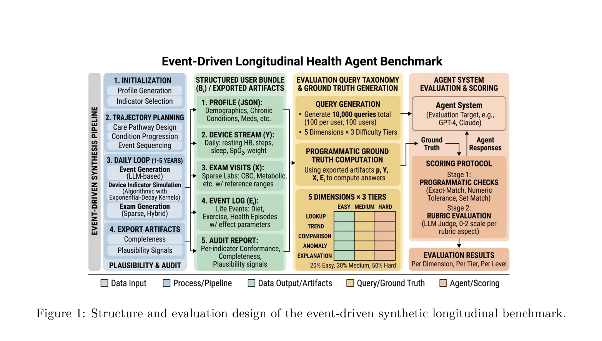
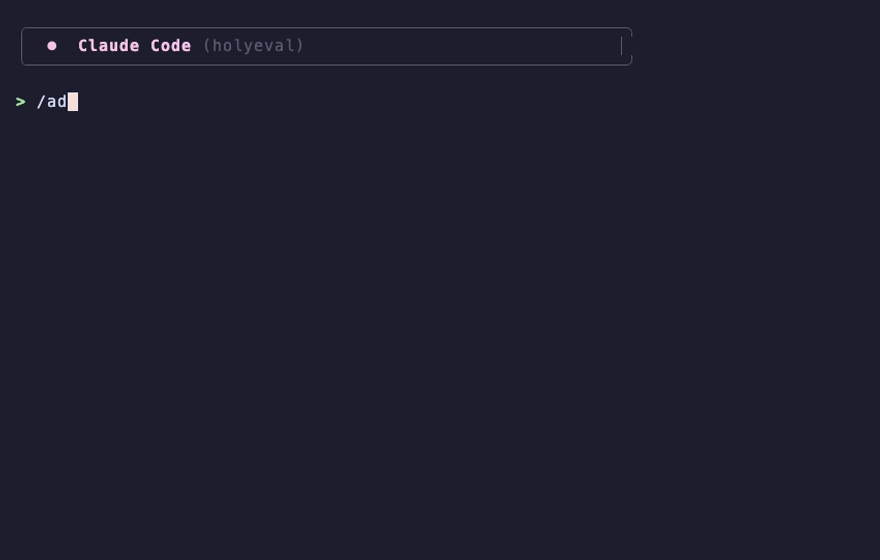
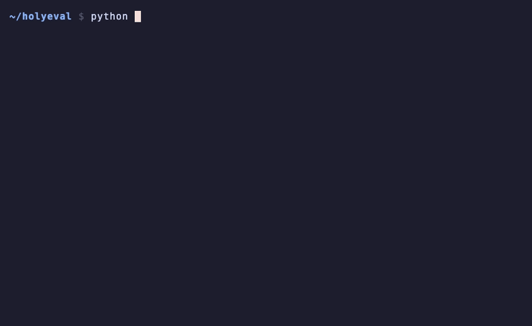
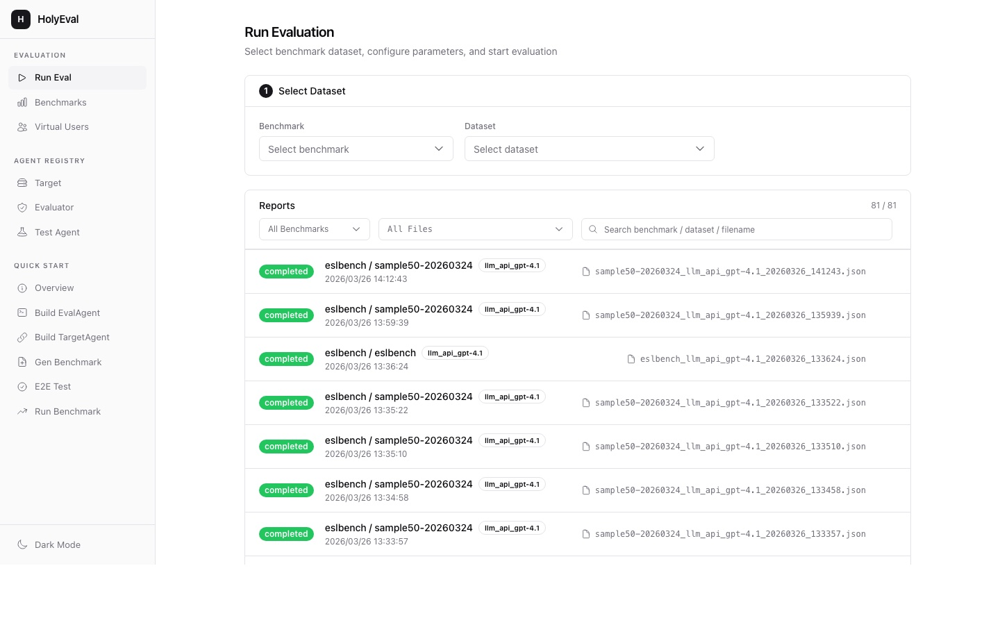
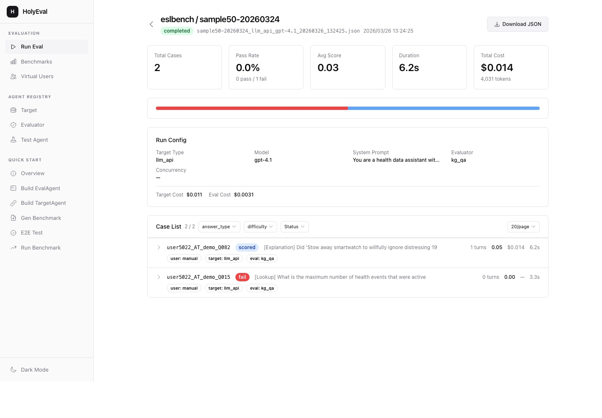
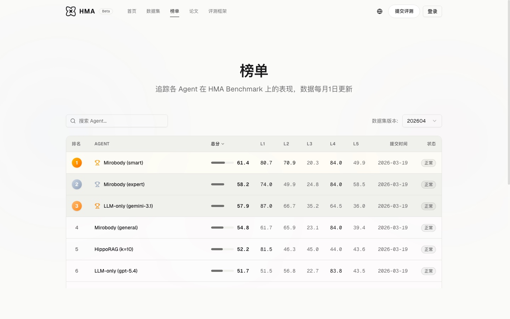
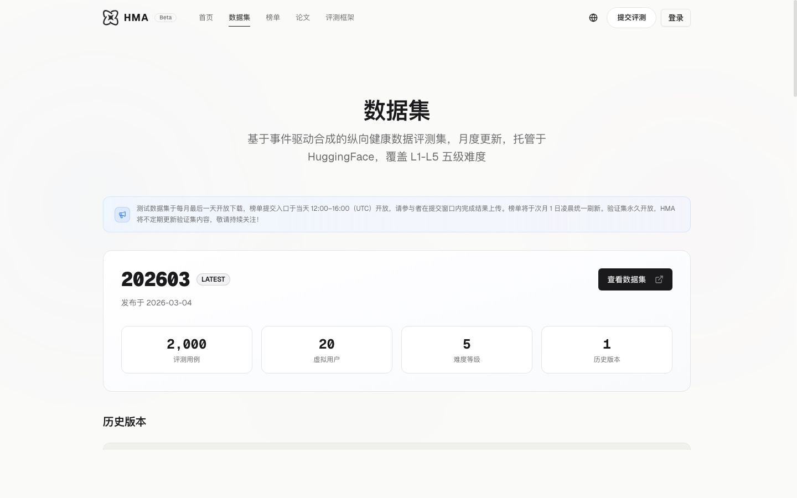
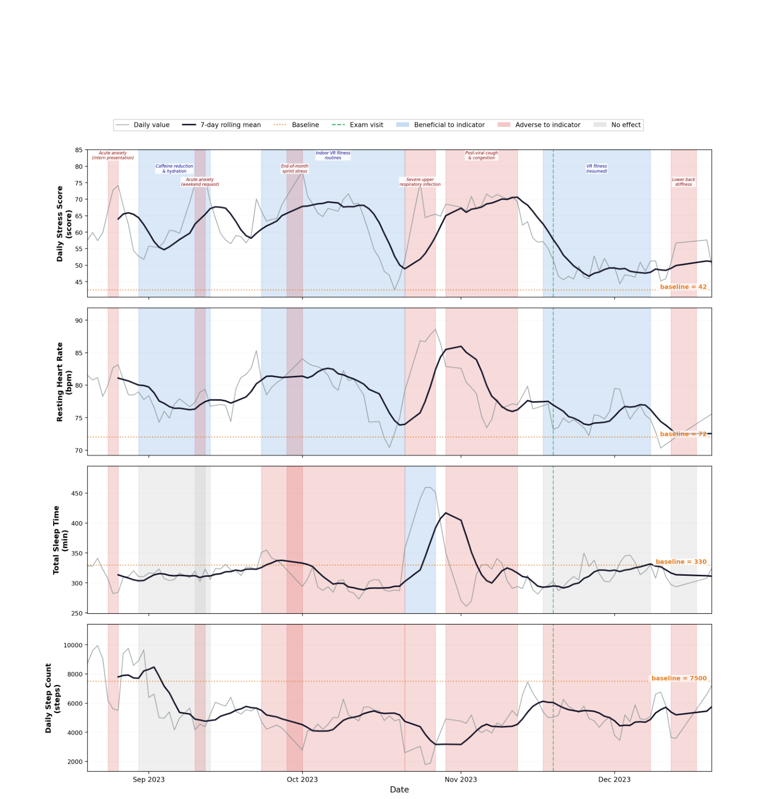

<h1 align="center">
  <br>
  mirobody-eval
  <br>
</h1>

<p align="center">
  <strong>一条命令复现任意 LLM 基准。用可插拔的 agent 搭自己的。<br>不用写代码——跟 Claude Code 说话就行。</strong>
</p>

<p align="center">
  <a href="https://github.com/thetahealth/mirobody-eval/blob/main/LICENSE"></a>
  <a href="https://www.python.org/downloads/"></a>
  <a href="https://docs.anthropic.com/en/docs/claude-code"></a>
  <a href="https://arxiv.org/abs/2604.02834"></a>
  <a href="https://huggingface.co/datasets/healthmemoryarena/ESL-Bench"></a>
  <a href="http://healthmemoryarena.ai"></a>
  <a href="https://github.com/thetahealth/mirobody-eval/stargazers"></a>
</p>

<p align="center">
  <strong><a href="README.md">English</a></strong> &middot; <strong>简体中文</strong>
</p>

<p align="center">
  <a href="#快速开始">快速开始</a> &middot;
  <a href="#评测你自己的-mirobody-部署">评测 mirobody</a> &middot;
  <a href="#用-claude-code-做-ai-原生开发">Claude Code</a> &middot;
  <a href="#web-ui">Web UI</a> &middot;
  <a href="http://healthmemoryarena.ai">在线演示</a> &middot;
  <a href="https://arxiv.org/abs/2604.02834">论文</a> &middot;
  <a href="https://huggingface.co/datasets/healthmemoryarena/ESL-Bench">数据集</a> &middot;
  <a href="#基准">基准</a> &middot;
  <a href="#参与贡献">参与贡献</a>
</p>

<p align="center">
  <a href="https://arxiv.org/abs/2604.02834">
    
  </a>
</p>

<p align="center">
  <em>ESL-Bench —— 面向健康 agent 的事件驱动合成纵向基准。
  <br>100 个合成用户，10,000 道题，5 个维度，标准答案由程序算出。
  <br>论文：<a href="https://arxiv.org/abs/2604.02834">arXiv:2604.02834</a></em>
</p>

---

mirobody-eval 是 [mirobody](https://github.com/thetahealth/mirobody)（开源健康数据引擎）的评测半边。它存在的意义是让 mirobody 的说法带上数字：把一个合成用户灌进你自己的部署，对它跑一遍基准，拿到一份带分数的报告。底层框架是通用的，所以同一条命令也能对任何你接进来的被测系统复现任何已发表的基准。放进一个基准数据集，跑一条命令，拿到评分报告。评测器、被测系统、虚拟用户都可以通过可插拔的 agent 架构自行扩展。

从一开始就按 [Claude Code](https://docs.anthropic.com/en/docs/claude-code) 原生项目来设计——从初始化到把一篇论文里的新基准接进来，每个流程都是一条交互式斜杠命令。你用自然语言描述意图，剩下的交给 Claude Code。**用它或扩展它，你一行代码都不必写。**

### 集成任意基准——只要粘论文链接

<p align="center">
  
</p>

> **从论文到评分报告，一次对话之内。** 粘一个链接，Claude Code 读论文、写转换器、生成数据集、做校验——完事。没有样板代码，不用手工建文件。

### 一条命令跑任意基准

<p align="center">
  
</p>

```bash
# 试一下 —— 带 --limit 3 时每条命令花费 < $0.05
uv run python -m benchmark.basic_runner healthbench sample --target-model gpt-5.4-mini --limit 3
uv run python -m benchmark.basic_runner medcalc sample --target-model gpt-5.4-mini --limit 3
uv run python -m benchmark.basic_runner virtual_user round1 --target-type llm_api --target-model gpt-5.4-mini --limit 3

# ESLBench 需要先准备数据（见下面的快速开始）
uv run python -m benchmark.basic_runner eslbench sample50-20260331 --target-model gpt-5.4-mini --limit 3

# 想跑全量？去掉 --limit
```

## 为什么用 mirobody-eval

| | |
|---|---|
| **论文 → 基准，一次对话** | 粘一个论文链接，Claude Code 读它、写转换器、生成数据集、做校验——完事 |
| **一条命令复现** | 任何已集成的基准，永远可以用一条 CLI 命令复现 |
| **可插拔架构** | 三类 agent（TestAgent、TargetAgent、EvalAgent）——每一类都用一个类就能扩展 |
| **多轮对话** | 模拟真实的用户会话，不只是单轮问答 |
| **批量执行** | 并发跑、实时进度、可取消、断点续跑 |
| **Web UI** | 可视化面板：发起评测、看报告、浏览数据集 |
| **AI 原生** | 为 [Claude Code](https://docs.anthropic.com/en/docs/claude-code) 而建——安装、运行、扩展全用自然语言，零样板 |

## 快速开始

用 [Claude Code](https://docs.anthropic.com/en/docs/claude-code)：直接 `/quick-start`，它会自动处理一切。

或者手动：

```bash
git clone https://github.com/thetahealth/mirobody-eval.git && cd mirobody-eval
uv sync
cp .env.example .env                    # 填入你的 OPENAI_API_KEY 或 GOOGLE_API_KEY

# 跑第一个基准（< $0.02）
uv run python -m benchmark.basic_runner healthbench sample --target-model gpt-5.4-mini --limit 2

# 启动 Web UI
uv run python -m web                    # http://localhost:8000
```

> **前置条件：** Python 3.11+、[uv](https://docs.astral.sh/uv/)、至少一个 LLM API key（OpenAI 或 Google Gemini）。
>
> **ESLBench 数据准备：** ESLBench 需要先从 HuggingFace 下载数据——跑 `uv run python -m generator.eslbench.prepare_data`（走 Web UI 时会自动做）。其余基准的数据随仓库自带。

## 评测你自己的 mirobody 部署

这是 mirobody-eval 存在的理由。刚装好的 [mirobody](https://github.com/thetahealth/mirobody) 数据库是空的，于是没什么可问它，也无法判断你做的改动到底有没有帮助。三条命令同时解决这两件事：

```bash
# 1. 从 HuggingFace 拉一个合成用户的五年轨迹（约 20 MB）
uv run python -m generator.eslbench.prepare_data

# 2. 灌进你那个部署的 Postgres，并让指标可被检索
export MIROBODY_CONFIG=/绝对路径/到/你的/mirobody/config.localdb.yaml   # 指明是哪个部署
uv run python -m generator.eslbench.seed_mirobody --users user5086@demo

# 3. 用 ESL-Bench 给你的部署打分
uv run python -m benchmark.basic_runner eslbench sample200-20260430 --target-type mirobody --limit 20
```

现在你有了 ESL-Bench 五个推理维度各自的分数——Lookup、Trend、Comparison、Anomaly、Explanation。换个模型、切 agent 类型、改个 prompt、加个工具，再跑一遍，看哪个维度动了。把 `--target-type llm_api` 指向同一批题，就得到一个纯检索的基线用来对比。

> **第 2 步的前置条件：** `uv sync --extra mirobody --python 3.12`（引擎要求 3.12+，而本项目自身跑在 3.11 上，所以这个 extra 在 3.11 上什么都不装），并且配置要指向你要灌的那个部署，外加一个能用的 embedding provider key。灌完之后 seed 会回头校验每个指标是不是真的能被 agent 检索到，**有问题就直接报错**——否则你会得到一个看起来满的数据库，而 agent 回答「我没有你的健康数据」，日志里还看不出原因。
>
> **第 3 步的前置条件：** 那个部署的 HTTP 服务在跑（`MIROBODY_BASE_URL`，默认 `http://localhost:18080`）。

### 文件上传演示

`labreport` 把这个合成用户的某次化验面板渲染成 PDF，让 mirobody 的入库链路有真东西可嚼。灌数据时把那次面板留出来，上传就带来了库里确实还没有的数据——「我的血脂什么趋势」这才是个真问题，而不是一个孤立的点：

```bash
uv run python -m generator.eslbench.seed_mirobody --users user5086@demo --hold-out-exams 1
uv run python -m generator.eslbench.labreport     --users user5086@demo -o samples/lab_report.pdf
```

`user5086@demo` 是一个生成出来的 58 岁 2 型糖尿病人，血脂在四次面板里先改善、后回落。每个数值都是合成的；PDF 首页就写着这一点。

打印出来的十二行里，八行能拿到 LOINC 编码，四行拿不到——报告上印的是 `High-Density Lipoprotein`，而 LOINC 编的是 `Cholesterol in HDL`；`LDL/HDL Ratio` 是个派生比值，压根没有对应的观测编码。这个混合是刻意的：它同时检验术语解析的命中与失手，而一个每行都能解析的面板做不到这件事。

## 用 Claude Code 做 AI 原生开发

mirobody-eval 的设计目标是完全通过 [Claude Code](https://docs.anthropic.com/en/docs/claude-code) 操作。每个常见任务都有专门的斜杠命令。你用自然语言说意图；Claude Code 去读代码、生成文件、跑测试、校验结果。

**你不用背 CLI 参数、不用读源码、不用写样板。** 敲斜杠命令，然后顺着对话走。

### 斜杠命令一览

| 你想做什么 | 命令 | Claude Code 替你做的事 |
|---|---|---|
| **初始化项目** | `/quick-start` | 检查 Python/uv、装依赖、把 API key 配进 `.env`、启动 Web UI |
| **跑一个基准** | `/run-benchmark` | 问你要哪个基准和数据集，然后按你选的模型和并发度执行 |
| **接一个新基准** | `/add-benchmark` | 端到端：读论文/仓库 → 分析数据格式 → 写转换器 → 生成数据集 → 校验 |
| **加一个自定义评测器** | `/add-eval-agent` | 生成配置模型 + 插件实现 + 注册。CLI 和 Web UI 里立即可用 |
| **加一个被测系统** | `/add-target-agent` | 为新的被测系统生成连接处理、消息处理和清理逻辑 |
| **审查架构** | `/review-architecture` | 检查 GitOps 合规、插件隔离、共享层复用，报告违规并给修法 |

### 工作流示例

**「我想在 GPT-4.1 上复现 HealthBench」**
```
> /run-benchmark
# Claude 问：哪个基准？→ healthbench
# 哪个数据集？→ sample
# 哪个模型？→ gpt-5.4-mini
# 跑多少条？→ 5（先从小开始！）
# 运行中…… 5 条 → 报告已保存
```

**「我需要一个检查引用准确性的评测器」**
```
> /add-eval-agent
# Claude 问：插件名？→ citation_accuracy
# 它评什么？→ 检查 AI 回答是否引用了有效来源
# 生成：evaluator/plugin/eval_agent/citation_accuracy_eval_agent.py
# 通过 __init_subclass__ 自动注册 —— 可以直接用
```

> **提示：** 你不必局限于斜杠命令。Claude Code 理解整个代码库——用自然语言问它任何事，比如*「插件系统是怎么工作的」*或*「这个用例为什么失败了」*。

## Web UI

`uv run python -m web` 启动，然后访问 http://localhost:8000。

<table>
<tr>
<td width="50%">

**发起评测** —— 选基准、配参数、启动任务，SSE 实时跟进度。


</td>
<td width="50%">

**评测报告** —— 带分数的结果，用例可展开，含对话历史和逐条反馈。


</td>
</tr>
<tr>
<td width="50%">

**浏览基准** —— 所有基准数据集的概览，含用例数和统计。
</td>
<td width="50%">

**Agent 注册表** —— 查看所有已注册插件的配置 schema、特性和成本估算。
</td>
</tr>
</table>

## Health Memory Arena —— 在线评测平台

[Health Memory Arena](http://healthmemoryarena.ai)（HMA）是由 mirobody-eval 驱动的公开评测平台。它托管着 ESL-Bench 排行榜，健康 AI agent 在结构化纵向推理任务上同台竞争。

<table>
<tr>
<td width="33%">
<a href="http://healthmemoryarena.ai"></a>
<p align="center"><em>平台首页</em></p>
</td>
<td width="33%">
<a href="http://healthmemoryarena.ai/leaderboard"></a>
<p align="center"><em>Agent 排行榜</em></p>
</td>
<td width="33%">
<a href="http://healthmemoryarena.ai/dataset"></a>
<p align="center"><em>数据集浏览</em></p>
</td>
</tr>
</table>

## 架构

```
TestCase (JSON) → Orchestrator
  1. 通过插件注册表按配置初始化各 agent
  2. 对话循环：TestAgent ↔ TargetAgent（直到结束或达到最大轮数）
  3. EvalAgent.run(conversation, session) → EvalResult
  4. 返回 TestResult（分数、通过/失败、反馈、成本）
```

所有执行路径（CLI、Web UI、程序调用）都汇聚到同一个入口：`do_single_test()`。

### 插件系统

三类 agent，每类都通过 `__init_subclass__` 自动注册来扩展：

```python
# 定义一个自定义评测器 —— 就这样，已经注册好了
class MyEvalAgent(AbstractEvalAgent, name="my_eval", params_model=MyEvalInfo):
    async def run(self, memory_list, session_info):
        # 你的评测逻辑
        return EvalResult(result="pass", score=0.95, feedback="...")
```

| Agent 类型 | 角色 | 内置插件 |
|---|---|---|
| **TestAgent** | 虚拟用户 | `auto`（LLM 驱动）、`manual`（照剧本） |
| **TargetAgent** | 被测系统 | `mirobody`（自部署实例）、`llm_api`（OpenAI / Gemini / OpenRouter）、`hermes`、`evermem`、`mem0_rag_api`、`naive_rag_api`、`hippo_rag_api`、`dyg_rag_api` |
| **EvalAgent** | 评测器 | `semantic`、`rubric`、`healthbench`、`medcalc`、`kg_qa`、`record_retrieval`、`dialogue_quality`、`engagement` |

### 项目结构

```
mirobody-eval/
├── evaluator/          # 核心引擎：schema、orchestrator、插件接口
├── benchmark/          # runner + 数据集（JSONL）+ 报告
│   └── data/eslbench/  # ESLBench：数据 + 工具（retrieve.py，JSON/DuckDB）
├── generator/          # 数据集转换器 + 数据准备脚本
│   └── eslbench/       # ESLBench 数据下载 + DuckDB 构建
└── web/                # Web UI（FastAPI + htmx）
```

## 基准

| 基准 | 论文 / 来源 | 数据集 | 评什么 |
|---|---|---|---|
| **HealthBench** | [OpenAI HealthBench](https://arxiv.org/abs/2505.07469) | `sample`（100）、`full`、`hard`、`consensus` | 医疗 AI 质量 |
| **MedCalc-Bench** | [MedCalc-Bench](https://arxiv.org/abs/2406.12036) | `sample`、`full` | 医学计算 |
| **ESLBench** | [arXiv:2604.02834](https://arxiv.org/abs/2604.02834) | `sample50-20260331`（50）、`sample500-20260331`（500）、`full-20260331`（4500） | 纵向健康推理 |
| **ESLBench-Distractor** | —— | `sample`（60）、`distractor-behavioral-20260723`（120）、`distractor-computable-20260723`（400） | 对干扰上下文的稳健性（复用 ESLBench 已准备好的数据） |
| **Virtual User** | —— | `round1`（15）、`round2`（60） | 开场白的互动质量 |

### ESLBench —— 事件驱动的合成纵向基准

ESLBench（[arXiv:2604.02834](https://arxiv.org/abs/2604.02834)）评测纵向健康推理能力——在多来源患者轨迹（设备数据流、临床检查、生活事件）之间对齐、聚合与归因的能力。它建立在一个事件驱动的合成框架上：每个用户的轨迹被建模为一个基线健康状态，加上一系列带明确时间核（sigmoid 起效、指数衰减）的离散事件，因此标准答案可由程序算出。

<p align="center">
  
</p>

<p align="center"><em>四个月轨迹片段 —— 事件驱动的指标动态，sigmoid 起效与指数衰减。</em></p>

**100 个合成用户**，轨迹跨度 1–5 年，**10,000 道评测题**，覆盖五个维度、三档难度：

| 维度 | 考什么 | 例子 |
|---|---|---|
| **Lookup** | 直接取数 | 「2024-03-15 的静息心率是多少？」 |
| **Trend** | 时序规律分析 | 「哪个月步数最高？」 |
| **Comparison** | 跨事件/跨来源对比 | 「开始跑步之后平均步数变化多少？」 |
| **Anomaly** | 异常检测 | 「血糖有异常过吗？」 |
| **Explanation** | 因果归因 | 「按对血糖下降的影响给事件排序」 |

<details>
<summary><strong>基准结果 —— 3 种范式下的 13 种方法</strong></summary>
<br>
主要发现：数据库型 agent（48–58%）显著优于记忆型 RAG（30–38%），差距集中在 Comparison 和 Explanation 这两类需要多跳推理和证据归因的题上。
</details>

**需要先准备数据** —— ESLBench 会从 HuggingFace 下载用户数据，并为每个用户建 DuckDB 索引：

```bash
# 首次：准备数据（走 Web UI 会自动做，CLI 需手动）
uv run python -m generator.eslbench.prepare_data

# 快速验证：3 条用例确认环境没问题（< $0.05）
uv run python -m benchmark.basic_runner eslbench sample50-20260331 --target-model gpt-5.4-mini --limit 3

# 抽样数据集
uv run python -m benchmark.basic_runner eslbench sample50-20260331 --target-model gpt-5.4-mini      # 50 条
uv run python -m benchmark.basic_runner eslbench sample500-20260331 --target-model gpt-5.4-mini -p 5 # 500 条

# 全量（4500 条 —— API 成本可观，跑之前先想清楚）
uv run python -m benchmark.basic_runner eslbench full-20260331 --target-model gpt-5.4-mini -p 5
```

被测的 LLM 会拿到一组工具（`eslbench/retrieve`）：读 JSON 文件、查 DuckDB、查指标——它必须用这些工具在用户的健康数据里找答案。

### 新增一个基准

两种方式：

**A）用 Claude Code skill（推荐）：**
```
/add-benchmark    # 引导式：读论文 → 转数据 → 校验
```

**B）手动：**
1. 建 `benchmark/data/<name>/metadata.json`，写好被测目标配置
2. 建 `benchmark/data/<name>/<dataset>.jsonl`，用 BenchItem 格式
3. 跑：`uv run python -m benchmark.basic_runner <name> <dataset> --target-model gpt-5.4-mini`

最小的 `metadata.json` + `sample.jsonl` 组合可参考 [benchmark/data/medcalc/](benchmark/data/medcalc/)。

## 扩展 mirobody-eval

### 新增评测器

```python
# evaluator/plugin/eval_agent/my_eval_agent.py
from typing import Literal
from pydantic import BaseModel, ConfigDict, Field

from evaluator.core.interfaces.abstract_eval_agent import AbstractEvalAgent
from evaluator.core.schema import EvalResult


class MyEvalInfo(BaseModel):
    model_config = ConfigDict(extra="forbid")
    evaluator: Literal["my_eval"] = "my_eval"
    threshold: float = Field(0.8, ge=0.0, le=1.0)


class MyEvalAgent(AbstractEvalAgent, name="my_eval", params_model=MyEvalInfo):
    async def run(self, memory_list, session_info):
        conversation = memory_list[-1].target_response
        score = your_scoring_logic(conversation)
        return EvalResult(result="pass" if score > 0.8 else "fail", score=score, feedback="...")
```

文件名必须以 `_eval_agent.py` 结尾——这个后缀是包内 `pkgutil` 自动导入的依据，而自动导入正是触发注册的东西。不需要往 `__init__.py` 里加任何东西。

### 新增被测系统

```python
# evaluator/plugin/target_agent/my_target_agent.py
from typing import Literal
from pydantic import BaseModel, ConfigDict

from evaluator.core.interfaces.abstract_target_agent import AbstractTargetAgent
from evaluator.core.schema import TargetAgentReaction


class MyTargetInfo(BaseModel):
    model_config = ConfigDict(extra="forbid")
    type: Literal["my_target"] = "my_target"
    base_url: str


class MyTargetAgent(AbstractTargetAgent, name="my_target", params_model=MyTargetInfo):
    async def _generate_next_reaction(self, test_action):
        response = await call_your_api(test_action)
        return TargetAgentReaction(type="message", message_list=[{"content": response}])
```

想要引导式脚手架，用 Claude Code 的 `/add-eval-agent` 或 `/add-target-agent`。

## CLI 参考

```bash
# 准备基准数据（ESLBench 必需；其余基准数据自带）
uv run python -m generator.eslbench.prepare_data          # 下载 HF 数据 + 建 DuckDB
uv run python -m generator.eslbench.prepare_data --force   # 强制重建

# 跑基准
uv run python -m benchmark.basic_runner <benchmark> <dataset> [options]
  --target-type TYPE      # 被测 agent 类型（多 target 的基准需要指定）
  --target-model MODEL    # 被测模型（如 gpt-5.4-mini、anthropic/claude-sonnet-4.6）
  --user-model MODEL      # 扮演虚拟用户的模型（仅 auto 模式数据集有效）
  --eval-model MODEL      # 判分用的模型（纯规则判分的题型不受影响）
  --system-prompt TEXT    # 覆盖被测系统的 system prompt
  --target-override K=V   # 覆盖某个可编辑的 target 字段，如 agent=Deep
  --limit N               # 最多跑多少条
  --ids id1,id2           # 只跑指定 ID 的用例
  -p, --parallel N        # 并发数（默认 0 = 不限）
  -v, --verbose           # 详细日志
  --resume                # 从上次检查点续跑

# 转换外部数据集
uv run python -m generator.healthbench.converter input.jsonl output.jsonl
uv run python -m generator.medcalc.converter input.csv output.jsonl
uv run python -m generator.virtual_user case_gen --seed 42 \
    --output benchmark/data/virtual_user/my_round.jsonl   # ⚠ 不传 --output 会覆盖随附的 round1.jsonl

# Web UI
uv run python -m web             # http://localhost:8000
```

一次评测最多驱动三个模型——虚拟用户、被测系统、判分器——每个都单独指定，所以一个 provider 可以同时充当三者：

```bash
uv run python -m benchmark.basic_runner virtual_user round1 \
    --target-type llm_api --target-model anthropic/claude-sonnet-4.6 \
    --user-model anthropic/claude-sonnet-4.6 \
    --eval-model anthropic/claude-sonnet-4.6
```

判分器只在 `text` 和 `behavioral` 两种答案类型上出场。`numeric_value`、`boolean`、`list` 是纯规则判分，压根不需要 key——ESL-Bench 的 `sample200-20260430` 里 200 条有 106 条属于这一类。如果配了判分器但它跑不起来，对应用例会被记为 `error` 而不是给个分数：判分器没跑，就等于对被测系统什么都没说，把它平均进去会被读成一个结果。

## 配置

环境变量（写在 `.env` 里）：

| 变量 | 是否必需 | 说明 |
|---|---|---|
| `OPENAI_API_KEY` | 至少配一个 | OpenAI API key |
| `GOOGLE_API_KEY` | 至少配一个 | Google Gemini API key |
| `HF_TOKEN` | ESLBench 需要 | 下载基准数据用的 HuggingFace token |
| `OPENROUTER_API_KEY` | 可选 | OpenRouter 多 provider 接入 |
| `HOLYEVAL_GATEWAY_BASE_URL` | 可选 | 你自己的 OpenAI 兼容网关（vLLM / LiteLLM / 自建中转）。仅当模型名写成 `[label]model` 时需要 |
| `HOLYEVAL_GATEWAY_API_KEY` | 可选 | 那个网关的 API key |
| `HOLYEVAL_WEB_PORT` | 可选 | Web UI 端口（默认 8000） |
| `HOLYEVAL_HEALTH_PORT` | 可选 | 健康检查端口（默认 8001） |
| `HOLYEVAL_RELOAD` | 可选 | `true` 开启 uvicorn 自动重载（默认 false） |

`mirobody` 这个被测目标的基础设施参数从环境变量读、不走数据集，因为它们描述的是*你指向哪个部署*，而不是要问它什么：

| 变量 | 是否必需 | 说明 |
|---|---|---|
| `MIROBODY_CONFIG` | 建议配 | 那个部署的 `config.{ENV}.yaml` 绝对路径。不配的话 `Config.init()` 会在当前工作目录里找——那是本仓库、不是那个部署——然后退回内置默认值 |
| `MIROBODY_BASE_URL` | 可选 | 部署地址（默认 `http://localhost:18080`） |
| `MIROBODY_TIMEOUT` | 可选 | 单轮超时秒数（默认 300） |
| `MIROBODY_PROVIDER` | 可选 | 覆盖那个部署 agent 的 LLM provider；留空则用它自己的默认值 |

## 路线图

### 进行中
- [ ] **GUI TargetAgent** —— 通过真实产品的 Web 界面评测，而不只是 API 端点。浏览器里的 agent 像真人一样操作你的应用，从而对任何带前端的产品做端到端评测

### 计划中
- [ ] **评测驱动的优化闭环** —— 跑基准 → 自动分析失败模式 → 生成针对性的 prompt/系统改进 → 重跑验证。把评测和迭代接成一个环
- [ ] **CI/CD 集成** —— `pip install mirobody-eval` 加上 `mirobody_eval.run("healthbench", model="gpt-5.4-mini")`，在你的 CI 流水线里一行搞定。跨轮次回归检测，分数掉了在上线前就告警
- [ ] **行业 agent 与 App 深度评测** —— 对主流 AI agent 和健康类 App（如 ChatGPT、Gemini、各类健康助手）出完整评测报告。在安全性、准确性、用户体验上做标准化打分，作为可复现的社区基准发布

## 开发

```bash
# 单元测试 —— 纯逻辑，不连库、不联网、不调模型
uv run --group dev python -m pytest generator/ evaluator/ -q

# 自检 —— 插件注册表能否加载
uv run python -c "import evaluator.plugin.eval_agent, evaluator.plugin.target_agent; \
from evaluator.core.interfaces.abstract_eval_agent import AbstractEvalAgent; \
print(sorted(AbstractEvalAgent.get_all()))"

# Lint 与格式化
uv run ruff check .
uv run ruff format .
```

CI 跑的就是上面这三样，外加一项检查：仓库里每个数据集声明的被测目标和评测器都真的存在——它要拦的是一个数据集发布出去、却引用了没人装得上的插件。

## 参与贡献

欢迎贡献！最省事的路径是通过 Claude Code——下面每种都有对应的引导式斜杠命令：

| 贡献类型 | 怎么开始 | 难度 |
|---|---|---|
| **加一个基准** | `/add-benchmark` —— 最快的贡献方式 | 容易 |
| **加一个评测器** | `/add-eval-agent` —— 搭一套新的打分方法 | 中等 |
| **加一个被测系统** | `/add-target-agent` —— 接一个新的 API/服务来评测 | 中等 |
| **改进已有基准** | 补更多用例、边界情况，或更好的 prompt | 容易 |

较大的改动请先开 issue 讨论。

## 引用

如果你在研究中用到 ESL-Bench 或 mirobody-eval，请引用：

```bibtex
@article{li2026eslbench,
  title={ESL-Bench: An Event-Driven Synthetic Longitudinal Benchmark for Health Agents},
  author={Li, Chao and Liu, Cailiang and Gao, Ang and Deng, Kexin and Zhang, Shu and Xu, Langping and Shi, Xiaotong and Ding, Xionghao and Pei, Jian and Jiang, Xun},
  journal={arXiv preprint arXiv:2604.02834},
  year={2026}
}
```

## 许可

[MIT](LICENSE)。第三方组件及其许可证列在 [THIRD_PARTY_NOTICES.md](THIRD_PARTY_NOTICES.md)。
