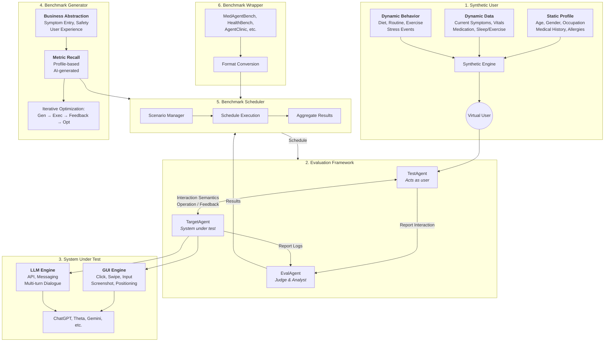

# HolyEval Architecture

## Component Descriptions

### 1. Synthetic User
Generates realistic user personas and behaviors.
- **Static Profile**: Demographics and historical data.
- **Dynamic Data**: Real-time state (symptoms, vitals).
- **Dynamic Behavior**: Lifestyle patterns and stressors.

### 2. Evaluation Framework
The core orchestration layer.
- **TestAgent**: Simulates the user's side of the conversation.
- **TargetAgent**: Interfaces with the system being evaluated.
- **EvalAgent**: Scores the interaction based on predefined metrics.

### 3. System Under Test (SUT)
The target model or application.
- **GUI Engine**: For testing visual interfaces.
- **LLM Engine**: For testing text-based APIs.

### 4. Benchmark Generator
Creates evaluation content.
- **Metric Recall**: Generates specific test cases based on business requirements.
- **Optimization**: Continuously improves benchmark quality.

### 5. Benchmark Scheduler
Manages the execution flow and result aggregation.

### 6. Benchmark Wrapper
Adapts external benchmarks (like HealthBench or AgentClinic) into the HolyEval format.
